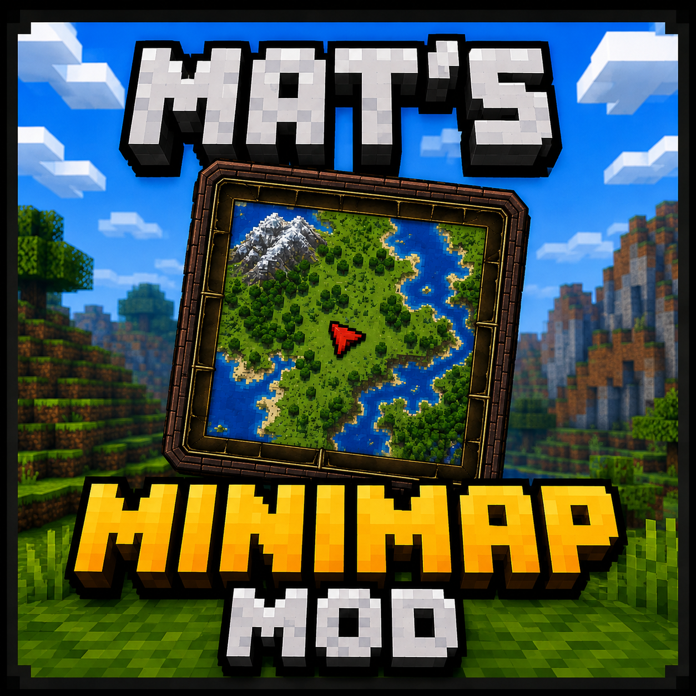

# Mat's Minimap



A configurable client-side minimap for **Minecraft 26.2** using Fabric.

## Features

- High-detail block-for-block terrain raster with relief shading
- Surface, water and underground cave mapping
- Circle and square map shapes
- Old and Modern border styles, or no border
- North-locked and player-direction orientations
- Responsive map sizing and configurable zoom
- Waypoints with editable names and colors
- Optional in-world waypoint markers and automatic deathpoints
- Optional mob/entity and dropped-item markers
- Gray dot or red arrow player marker
- Settings menu opened with `/matsminimap`
- Quick waypoint creation with `B`

## Requirements

- Minecraft 26.2
- Fabric Loader 0.19.3 or newer
- Fabric API
- Java 25

## Installation

1. Install Fabric Loader and Fabric API for Minecraft 26.2.
2. Download the latest JAR from [Releases](../../releases).
3. Place the JAR in the Minecraft `mods` folder.

Settings are stored in `config/mats-minimap.properties` and persist between launches and mod updates.

## Building

```bash
./gradlew build
```

The release JAR is generated in `build/libs/` without the `-sources` suffix.

## License

Licensed under the MIT License. This is a clean-room implementation and contains no copied code from other minimap mods.
